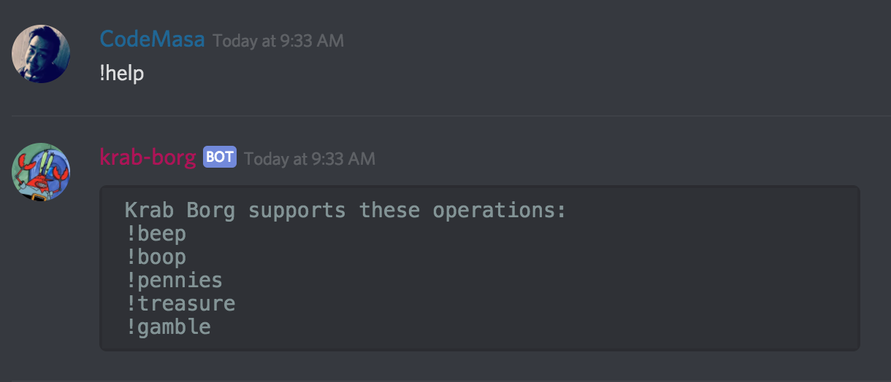
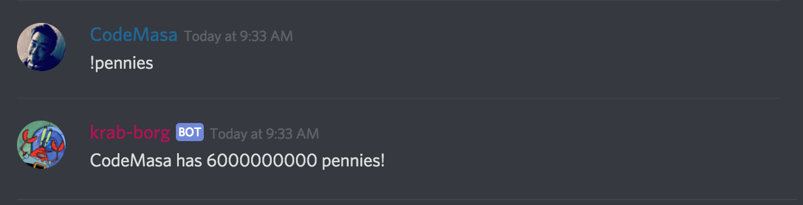
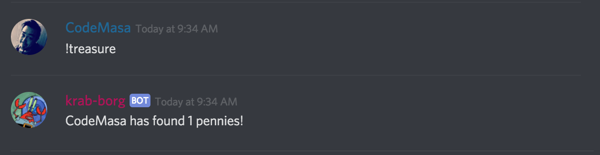
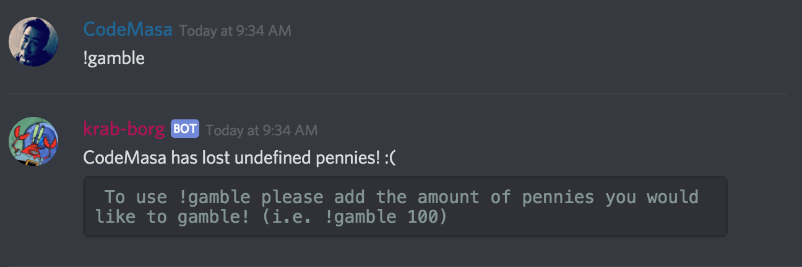
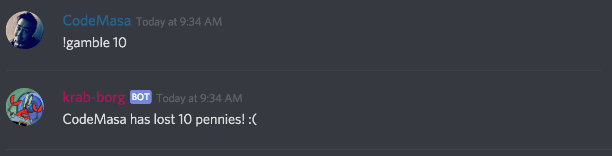
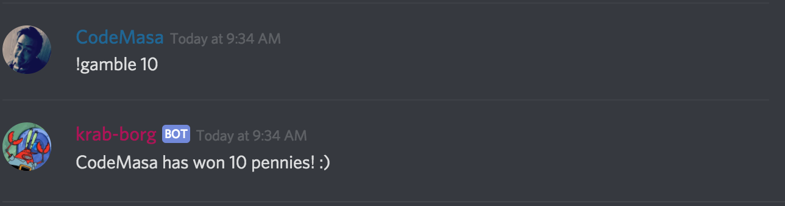

# Krab Borg #
## Purpose ###
### Writing a bot ###
- Looking at the inner workings of how chat bots work
- Creating a deliverable project
-Using JSON files and mongodb/nosql to store information

## Dependencies ##
- NodeJS

## Usage ##
### Discord ###
- Add Bot to Discord

### Console ###
- Put tokenid into ./auth_template.json
- In consle: `npm build`
- Then: `node krab_borg.js`

### Discord (again) ###

